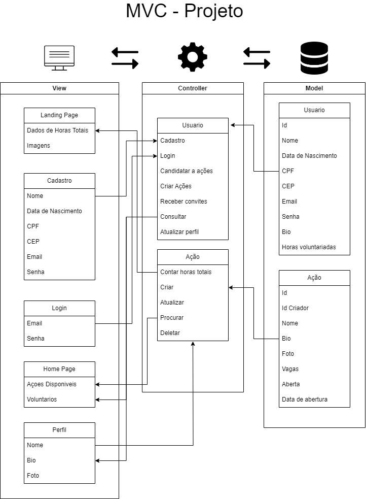

# Ponderada semana 1 - Modulo 2

### **MVC (Model, View, Controller) Arquitetura**

- A arquitetura MVC (Model, View, Controller) é um padrão de arquitetura de software que separa a aplicação em três componentes principais: Model, View e Controller. Ela é uma arquitetura de software que facilita a manutenção e a escalabilidade do projeto, pois separa as responsabilidades da aplicação em camadas distintas.
### **Model**

- O model é a camada de dados da aplicação, onde são armazenados os dados e a lógica de negócio. Ele é responsável pela manutenção dos dados. Ele responde as solicitações do controller, mas nunca se comunica diretamente com a view.

### **View**

- A view é a camada de apresentação da aplicação, onde são exibidos os dados ao usuário. Ela é responsável por exibir os dados e responder as ações do usuário. Ela responde as solicitações do controller, mas nunca se comunica diretamente com o model.

### **Controller**

- O controller é a camada de controle da aplicação, onde são tratadas as requisições do usuário. Ele é responsável por intermediar a comunicação entre a view e o model. Ele responde as solicitações do usuário e solicitações do model.

### MVC do projeto

    
   
   Legenda: Mvc do projeto - Grupo 3 (css)

### **Decisões de Design e Porque o MVC**

- A arquitetura MVC foi escolhida para o projeto, pois ela é uma arquitetura de software que separa a aplicação em três componentes principais: Model, View e Controller, facilitando a manutenção e a escalabilidade do projeto.

### **Objetivos e Requisitos do Projeto**

### **View**
- Landing Page: Tela inicial do plataforma, que apresenta informações gerais sobre o projeto e links para outras telas.
- Cadastro: Tela que permite que novos usuários se registrem no plataforma.
- Login: Tela que permite que usuários existentes se autentiquem no plataforma.
- Home Page: Tela principal do plataforma, que apresenta informações sobre as ações disponíveis e os voluntários que já se cadastraram.
- Perfil: Tela que exibe as informações do perfil do usuário, como nome, bio e foto.

### **Controller**
- Usuário: Interage com o plataforma através das interfaces gráficas (telas).
  - Receber convites: Permite que voluntários aceitem ou recusem convites para participar de ações.
  - Consultar: Permite que voluntários consultem as ações das quais estão participando.
  - Atualizar perfil: Voluntários atualizem as informações do seu perfil.
  - Contar horas totais: Tela que permite que voluntários consultem o total de horas que já dedicaram ao voluntariado.

- Ação: Interage com o plataforma através das interfaces gráficas (telas).
  - Ações Disponíveis: Mostra as ações disponíveis para voluntariado.
  - Criar Ação: Cria novas ações de voluntariado.
  - Procurar: Procurar ações por nome.
  - Deletar: Excluir ações.

### **Model**

- Usuário: Armazena as informações dos usuários, como nome, bio e foto.
- Ação: Armazena as informações das ações, como nome, descrição e data.

